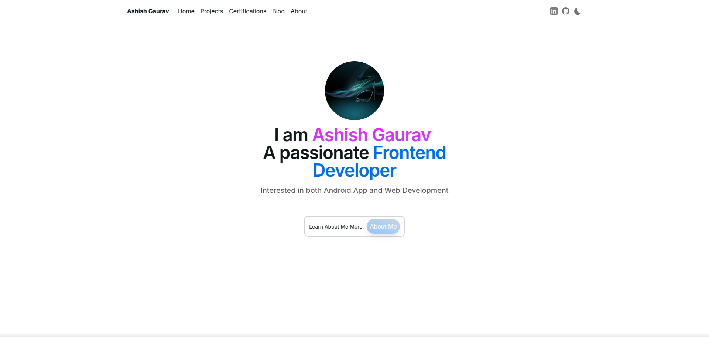

# [ashish-portfolio-main.vercel.app](https://ashish-portfolio-main.vercel.app)

---

This is a portfolio website built using Next.js 14 (app directory) and NextUI (v2).

## Screenshot



## Getting Started

First, run the development server:

```bash
npm run dev
# or
yarn dev
```

Open [http://localhost:3000](http://localhost:3000) with your browser to see the result.
